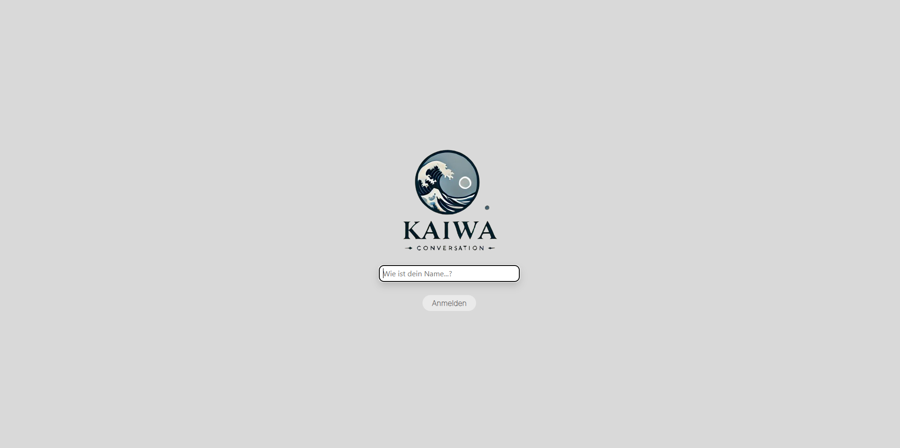
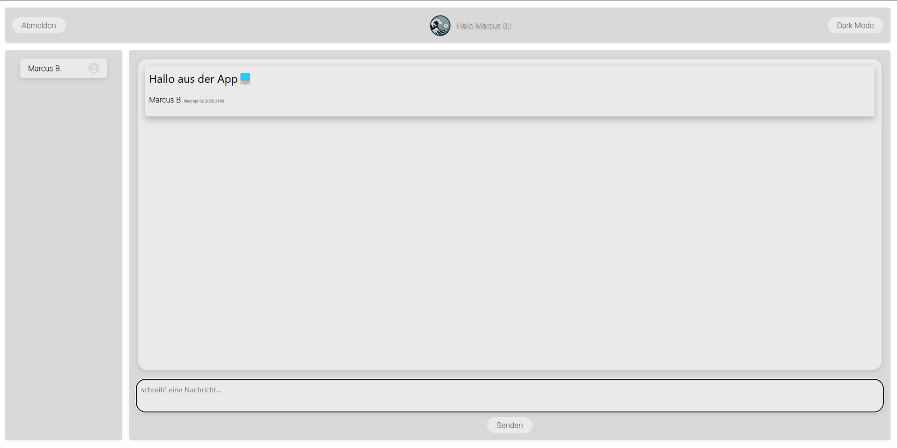

# Kaiwa - Realtime Chat-App

  
*Eine Echtzeit-Chat-Anwendung als Praxisprojekt*

---

## 📌 Über das Projekt

**Kaiwa** ist eine Echtzeit-Chat-App, die es Nutzern ermöglicht, Nachrichten in Echtzeit zu senden und zu empfangen. Die Anwendung wurde als Gemeinschaftsprojekt im Rahmen unseres Praxis-Projekts mit agilen Methoden entwickelt (*14.10.-28.10.2024*) während unserer Weiterbildung zum **Dev/Ops- und Cloud-Engineer**.

🔹 **Teammitglieder:**  
- **Ilona Görgens** (*Styling und Benutzerfreundlichkeit, Express.js-Boilerplate*)
- **Kaho Aoyama** (*Datenbank und Backend-Funktionalitäten*)
- **Marcus Bieber** (*Websocket-Verbindung, Backend, Deployment*)

✍️ *"Kaiwa" ist japanisch und bedeutet „Konversation“ oder „Gespräch“. Die Anwendung repräsentiert einen Ausschnitt dessen, was wir bisher gelernt haben – von der UI-Gestaltung bis zur Echtzeitkommunikation.*

---

## 🛠️ Verwendete Technologien

- **Frontend:** React
- **Backend:** Express.js, Socket.io
- **Datenbank:** SQLite3
- **Cloud:** AWS

---

## 🚀 Installation & Lokale Nutzung

Führe die folgenden Schritte aus, um die Anwendung lokal zu testen:

### 1️⃣ Repository klonen
```sh
 git clone https://github.com/marcusBieber/kaiwa.git
```

### 2️⃣ Navigiere in das Projektverzeichnis
```sh
 cd kaiwa
```

### 3️⃣ Abhängigkeiten installieren
Führe diesen Befehl in den jeweiligen Ordnern aus:
```sh
 npm install  # In den Ordnern: frontend/, backend/, backend/database/
```

### 4️⃣ Backend starten
```sh
 cd backend && npm start
```

### 5️⃣ Frontend starten
```sh
 cd frontend && npm run dev
```

### 6️⃣ Anwendung öffnen
Öffne im Browser:
[http://localhost:????](http://localhost:????) *(Port-Nummer entsprechend anpassen)*

### 🎉 Jetzt anmelden, chatten und Spaß haben! 🎉

---

## 📸 Screenshots / GIFs

Füge hier Bilder oder GIFs deiner Anwendung ein, um sie visuell zu präsentieren.

  
  


---

## 🛠️ Mögliche Weiterentwicklungen

- **Erweiterung der Benutzerprofile** 🏷️
- **Push-Benachrichtigungen für neue Nachrichten** 🔔
- **Mobile App-Version mit React Native** 📱

---

📧 **Kontakt:** biebermarcus1@gmail.com  


